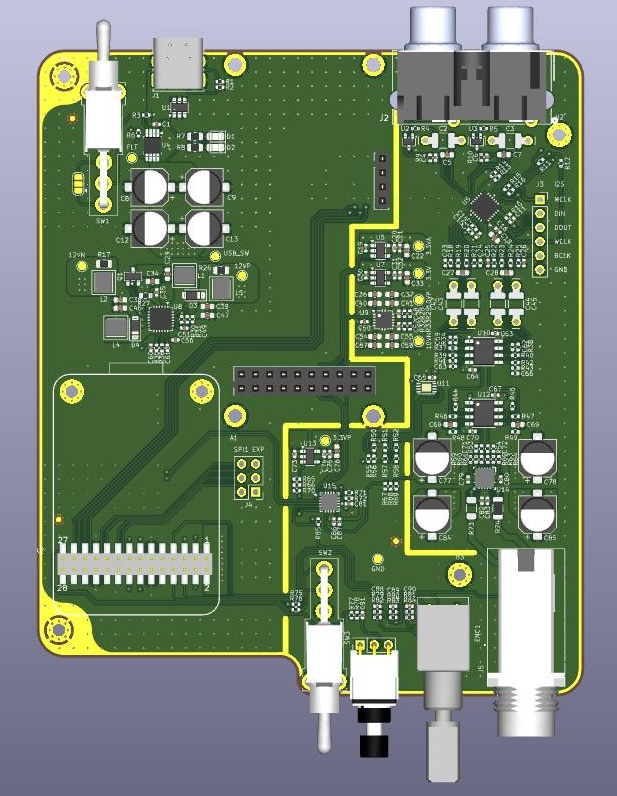

# Mini_DSP
Overview
Another iteration on my fascination with partially finishing headphone amplifiers with some form of DSP. This design takes everything I've learned from the other repositories and simplifies it in a way that makes me think I'll actually finish it.

Prior iterations had issues such as: too low performance (redditors poo-poo'd my ADAU1701 design), too complex and too costly (the ADAU1450 design). The gist is I never ended up making them because I was never happy enough to spend the money on something I wasn't confident would work.

Features: 
- Analog audio input from RCA jacks
- Digital audio input from York USB to I2S module
- ADC/DAC stage using TAC5212, with potential for basic biquad filters later on
- Output stage based on TPA6120A2
- USB powered, analog stage runs off +/-10V
- Front panel control performed by an STM32 MCU on the https://github.com/bengineer91/STM32G4_SOM

Known Debug Issues:
- Removed R79 and R81, added to to other side of the series resistor via white wire on back of board
- ~0.6V DC offset on the output of R74 when +/-10V is off
- currently determining which is manufacturing vs design

V2 Suggested Improvements
- I2C test points
- encoder pull ups need to be between series resistor and encoder
- thru hole test point for ground so I can clip a lead to it
- testability: add jumpers so I can manually turn on/off the power rails. Currently beholden to the ADS7128 working.

